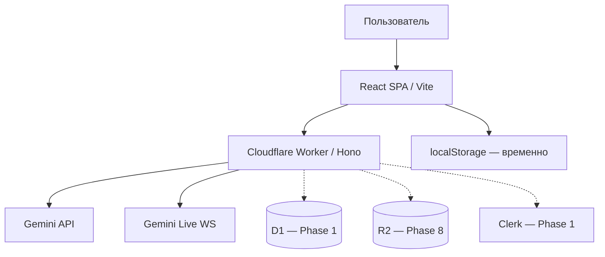

# Карта проекта Persony

## Идея

**Persony** (`persony.org`) — open platform for persistent AI personas.  
Create them. Share them. Work with them.

Сейчас: рабочий MVP-мессенджер (Telegram/ChatGPT-like UX) с AI-персонажами, голосом и PWA.  
Цель: облачная платформа с auth, cloud data, Energy billing, публичным каталогом, памятью и Rooms — **без переписывания MVP с нуля**.

Для кого: люди, создающие и использующие постоянных AI-собеседников; профессионалы, собирающие AI-команду в Rooms.

## Устройство



| Путь | Назначение |
|------|------------|
| `src/` | React UI |
| `src/lib/` | Shared client libs (SSE parser, …) |
| `worker/` | API + WebSocket proxy |
| `worker/lib/` | Gemini, models, provider errors |
| `specs/` | Spec-driven roadmap |
| `docs/GOAL_MODE_STATE.md` | Goal-mode: gates и фаза |
| `DESIGN.md` | Дизайн-система |
| `wrangler.jsonc` | Cloudflare конфиг |

**Production:** https://beta.persony.org (fallback: https://persony.pavel-9e7.workers.dev)  
**Repo:** https://github.com/baver001/persony

## Статусы

### В работе — Beta Release Candidate (2026-09)

- **Цель:** закрытая beta без Paddle billing; всё видимое — production-quality или скрыто flag
- **Трекер:** `docs/BETA_RC_PROGRESS.md`, `docs/BETA_READINESS.md`
- **Готово (git `023ab15`, deployed):** Persona Editor reset, canonical IDs, DTO round-trip, My Personas center, async save, import-modal UX, Avatar Studio fallback, Rooms hidden, billing hidden, avatar model `gemini-3.1-flash-image`, Discover install states, Owner KPI + period charts, Playwright beta-critical **12/12**
- **Заблокировано:** official avatars (Unsplash → generated), device Voice Call QA, beta reset execute
- **Скрипты:** `scripts/reset-beta-user-personas.mjs`, `scripts/generate-official-avatars.mjs`

### Готово (MVP baseline)

- Чат со streaming, голосовые заметки, Gemini Live, транскрипты звонков в истории
- Mobile voice stability (`specs/04-mobile-voice-stability.md`)
- Иконка P + paper plane, центрирование touch-target кнопок
- CF Workers + GitHub Actions CI/CD (`docs/CI_CD.md`)
- Дизайн-токены Persony

### Готово — Phase 1.0 (cloud foundation)

- D1 `persony-db` + migrations `0001` / `0002`
- Internal user identity: Clerk/dev → `users.id` (lazy provisioning)
- Persona CRUD, cloud conversations/messages, SSE persist
- Security: strict CORS, anonymous billable blocked
- `POST /api/import/local-v1` + import modal; Clerk React UI
- `specs/06-cloud-data-auth.md`

### Готово — Phase 1.1 Integrity Hardening (local verified)

- Migration `0003`: `inference_runs`, `conversations.status` / `deleted_at`
- E2E idempotency: `clientRequestId` → один user message, один inference, один persona reply
- Failed inference retry без дубля user bubble; completed run replay
- Import idempotent для user **и** persona messages (`import:local_v1:{id}`)
- Conversation soft delete; queries игнорируют `deleted`
- Persona version pinned (`conversation.persona_version` → `getPersonaVersion`)
- Frontend: pagination (scroll-up), Clear Chat = `DELETE` conversation
- Live Voice: server loads pinned persona + history (`live-context-service`)
- 39 tests incl. `worker/integration/phase11-integrity.test.ts`

### Готово — Phase 1.1 gate

- Commits pushed; migration `0003` applied; production deploy verified (health)

### Готово — Phase 1.2 Persona + Memory + Trust + i18n (core)

- Migration `0004`–`0005`: roles, memory, candidates, audit, settings
- PersonaSpec v1 + PersonaCompiler + official roster
- Memory extraction/retrieval + `/memory` UI (grouped + pending candidates)
- i18next EN/RU
- Owner RBAC + audit log

### Готово — Phase 1.3 Closed Beta (код; verify deploy)

- Battery beta (`0006`), EnergyService, UI, charge on all AI endpoints
- PersonaRelationship + profile block
- Structured memory extractor + supersede
- Discover `/discover`, My Personas `/my-personas`
- Live call stable modal, feedback 👍👎, Persona Creator v2 sliders
- Owner Console: Overview, Users, Personas, Memory, Battery, AI, Settings, Audit

### Готово (Phase 0)

- SSE parser, provider error fallback, Vitest + CI
- `specs/05-platform-roadmap.md`

### Готово — Phase 2 Multi-provider AI

- `worker/providers/` — Gemini + DeepSeek chat adapters
- `worker/services/model-router.ts` — `chat_text_provider` setting (`google` | `deepseek` | `auto`)
- `specs/07-ai-provider-router.md`, `eval/persona-chat.json`

### Готово — Phase 3 Energy simulation

- `battery_mode = simulation` (alias `beta_regen`) — списание + lazy regen, без оплат
- UI: режим симуляции в Battery sheet и Settings

### Готово — Phase 4 Paddle prep (не подключено)

- Migration `0007`: `energy_packs`, `billing_purchase_intents`, `paddle_webhook_events`
- `PaddleBillingProvider` stub, `GET /api/me/billing`, checkout/webhook → 501/503
- `specs/billing-future.md` — чеклист включения

### Готово — Phase 5 (частично)

- Публичная страница `/p/:slug`, share link, visibility в Persona Creator
- Вертикальная батарейка в шапке сайдбара (место логотипа) + mobile chat header

### Готово — Phase 7 Rooms (MVP)

- `GET/POST /api/rooms`, `/rooms` UI, `specs/11-rooms.md`
- Комната = 2–4 персоны; чат пока через direct open (routing — дальше)

### Дальше

1. **Phase 7+** — @mentions, room thread routing, budgets
2. **Phase 8–10** — Tools, voice hardening, OSS/BYOK
3. Paddle live (оператор) после legal + catalog

### В работе — Verified Economics & Owner Control Center

- Reconciliation: [`docs/ECONOMICS_RECONCILIATION.md`](docs/ECONOMICS_RECONCILIATION.md)
- Goal state: [`docs/GOAL_MODE_STATE.md`](docs/GOAL_MODE_STATE.md)
- Metrics: [`docs/METRICS.md`](docs/METRICS.md) · Owner spec: [`specs/owner-console.md`](specs/owner-console.md)
- Production SHA: `0b0e752` (2026-09-19) — CostEngine 2.0 on D1 (`e2ac39dc`), layout contract smoke, optional CI owner smoke
- Milestone 1 orchestrator: `npm run smoke:economics:milestone1` (operator always; owner + parity when JWT set)
- Operator smoke: `npm run smoke:economics` (public + D1 + layout contract)
- Milestone 1 E2E: [`docs/PRODUCTION_ECONOMICS_SMOKE.md`](docs/PRODUCTION_ECONOMICS_SMOKE.md) — **owner JWT + layout sign-off open**

### Проверить

- Health endpoint не должен раскрывать `hasApiKey` в production (Phase 0 security)
- Live voice regression на iOS/Android после каждого voice-изменения
- Economics truth: cost_confidence, unpriced ≠ $0, inference detail E2E on production

## Решения

- **Инкрементальное развитие** — не big-bang rewrite (`specs/05-platform-roadmap.md`)
- **Backend authoritative** — persona version, history, inference lifecycle на сервере (Phase 1.1)
- **Нет free tier** — одна trial-батарея, далее Energy (Phase 3)
- **D1** как system of record; **localStorage** только UI prefs (Phase 1)
- Деплой на Workers; Express `server.ts` — legacy dev only

## Режим зрелости

**MVP → платформа** (переход; см. goal-mode objective)

## Модульность (целевая)

| Модуль | Сейчас | Цель |
|--------|--------|------|
| Chat UI | `ChatArea`, `App` | `features/chat` |
| Personas | localStorage + modals | `domain/persona` + D1 |
| AI | `worker/lib/gemini.ts` | `providers/` + router |
| Billing | — | `worker/billing/` |
| Auth | — | `lib/auth` + Clerk adapter |

## Продуктовая жизнеспособность

### Задача

Постоянные AI-персоны с памятью, шарингом и профессиональными Rooms — не «ещё один frontend к Gemini».

### Решение

Messenger-first UX + cloud personas + Energy economy + viral loop (`/p/:slug` → signup → trial → chat).

### Доставка

Публичные страницы персон (SEO), share/remix, каталог Discover — acquisition без paywall на просмотр.

### Петля распространения

Автор публикует Persona → ссылка → новый пользователь → trial → install → свой чат → создаёт свою Persona.

## Экономика (гипотеза)

- 100% battery ≈ $2 retail AI (config-driven)
- Target gross margin on AI: 80%
- Trial: +1 full battery once per account
- Пакеты recharge: $10 / $20 / $50 (Phase 4)

## Данные и безопасность

| Сейчас | Цель |
|--------|------|
| localStorage personas/messages | D1 + optional import |
| Client sends `systemPrompt` | Server loads persona version |
| Open CORS / health leaks | Auth middleware, sanitized health |
| GEMINI_API_KEY in CF secrets | Managed keys; BYOK for self-host |

## Эксплуатация

```text
npm ci && npm run lint && npm test && npm run build && wrangler deploy
```

CI: `.github/workflows/deploy.yml` (lint → test → build → migrate → deploy)
