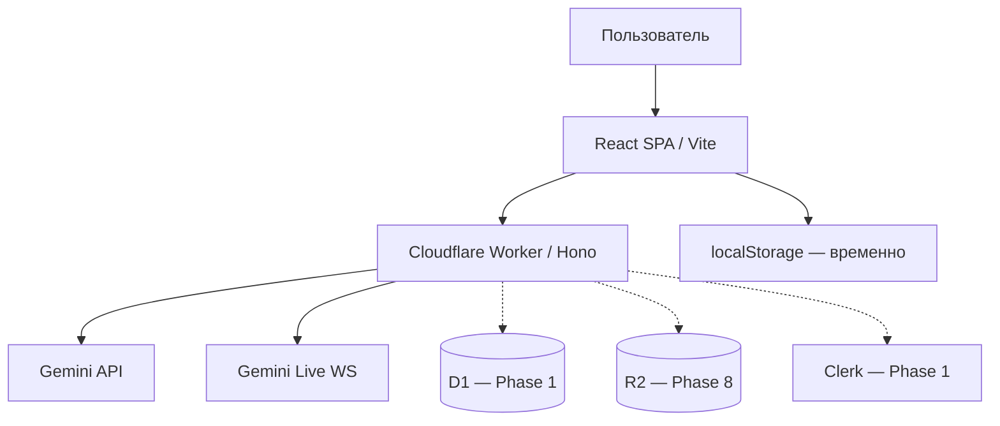

# Карта проекта Persony

## Идея

**Persony** (`persony.org`) — open platform for persistent AI personas.  
Create them. Share them. Work with them.

Сейчас: рабочий MVP-мессенджер (Telegram/ChatGPT-like UX) с AI-персонажами, голосом и PWA.  
Цель: облачная платформа с auth, cloud data, Energy billing, публичным каталогом, памятью и Rooms — **без переписывания MVP с нуля**.

Для кого: люди, создающие и использующие постоянных AI-собеседников; профессионалы, собирающие AI-команду в Rooms.

## Устройство



| Путь | Назначение |
|------|------------|
| `src/` | React UI |
| `src/lib/` | Shared client libs (SSE parser, …) |
| `worker/` | API + WebSocket proxy |
| `worker/lib/` | Gemini, models, provider errors |
| `specs/` | Spec-driven roadmap |
| `docs/GOAL_MODE_STATE.md` | Goal-mode: gates и фаза |
| `DESIGN.md` | Дизайн-система |
| `wrangler.jsonc` | Cloudflare конфиг |

**Production:** https://persony.pavel-9e7.workers.dev  
**Repo:** https://github.com/baver001/persony

## Статусы

### Готово (MVP baseline)

- Чат со streaming, голосовые заметки, Gemini Live, транскрипты звонков в истории
- Mobile voice stability (`specs/04-mobile-voice-stability.md`)
- Иконка P + paper plane, центрирование touch-target кнопок
- CF Workers + GitHub Actions deploy
- Дизайн-токены Persony

### В работе — Phase 0 (baseline hardening)

- SSE parser с persistent buffer + Vitest
- Классификация ошибок provider / selective model fallback
- `npm test` в CI
- `specs/05-platform-roadmap.md`

### Дальше (по фазам roadmap)

1. **Phase 1** — Auth (Clerk), D1, cloud personas/conversations, server-authoritative prompts
2. **Phase 2** — Multi-provider (DeepSeek + Gemini), ModelRouter, eval
3. **Phase 3** — Energy wallet, trial battery, CostEngine
4. **Phase 4** — Paddle recharge
5. **Phase 5** — Public catalog, share, remix
6. **Phase 6–10** — Memory, Rooms, tools, voice hardening, OSS

### Проверить

- Health endpoint не должен раскрывать `hasApiKey` в production (Phase 0 security)
- Live voice regression на iOS/Android после каждого voice-изменения

## Решения

- **Инкрементальное развитие** — не big-bang rewrite (`specs/05-platform-roadmap.md`)
- **Backend authoritative** — клиент перестанет слать `systemPrompt` (Phase 1)
- **Нет free tier** — одна trial-батарея, далее Energy (Phase 3)
- **D1** как system of record; **localStorage** только UI prefs (Phase 1)
- Деплой на Workers; Express `server.ts` — legacy dev only

## Режим зрелости

**MVP → платформа** (переход; см. goal-mode objective)

## Модульность (целевая)

| Модуль | Сейчас | Цель |
|--------|--------|------|
| Chat UI | `ChatArea`, `App` | `features/chat` |
| Personas | localStorage + modals | `domain/persona` + D1 |
| AI | `worker/lib/gemini.ts` | `providers/` + router |
| Billing | — | `worker/billing/` |
| Auth | — | `lib/auth` + Clerk adapter |

## Продуктовая жизнеспособность

### Задача

Постоянные AI-персоны с памятью, шарингом и профессиональными Rooms — не «ещё один frontend к Gemini».

### Решение

Messenger-first UX + cloud personas + Energy economy + viral loop (`/p/:slug` → signup → trial → chat).

### Доставка

Публичные страницы персон (SEO), share/remix, каталог Discover — acquisition без paywall на просмотр.

### Петля распространения

Автор публикует Persona → ссылка → новый пользователь → trial → install → свой чат → создаёт свою Persona.

## Экономика (гипотеза)

- 100% battery ≈ $2 retail AI (config-driven)
- Target gross margin on AI: 80%
- Trial: +1 full battery once per account
- Пакеты recharge: $10 / $20 / $50 (Phase 4)

## Данные и безопасность

| Сейчас | Цель |
|--------|------|
| localStorage personas/messages | D1 + optional import |
| Client sends `systemPrompt` | Server loads persona version |
| Open CORS / health leaks | Auth middleware, sanitized health |
| GEMINI_API_KEY in CF secrets | Managed keys; BYOK for self-host |

## Эксплуатация

```text
npm ci && npm run lint && npm test && npm run build && wrangler deploy
```

CI: `.github/workflows/deploy.yml` (lint → test → build → deploy)
