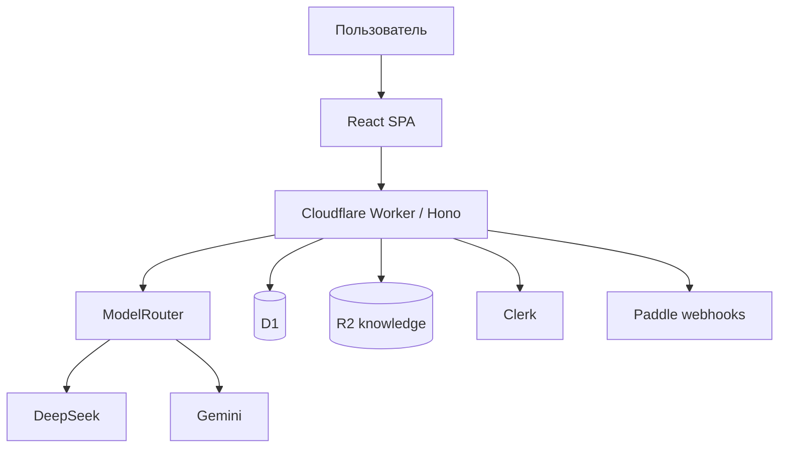

# Карта проекта Persony

## Идея

**Persony** (`persony.org`) — open platform for persistent AI personas.  
Create them. Share them. Work with them.

MVP-мессенджер эволюционировал в платформу: cloud data, multi-provider AI, Energy billing, Discover, Memory, Rooms.

## Устройство



| Путь | Назначение |
|------|------------|
| `src/` | React UI (Chats, Discover, Rooms, Profile) |
| `worker/providers/` | AIProvider adapters + router |
| `worker/billing/` | CostEngine, Energy, Paddle |
| `worker/services/` | inference, memory, rooms, catalog |
| `eval/` | Persona benchmark scenarios |
| `schemas/` | Portable `persony.persona.json` |
| `specs/` | Spec-driven roadmap 00–13 |

**Production:** https://persony.pavel-9e7.workers.dev

## Статусы (2026-09-15)

### Готово (locally verified)

- Phase 1: Cloud foundation
- Phase 2: Multi-provider AI + eval suite
- Phase 3: Energy wallet, trial battery, CostEngine
- Phase 4: Paddle webhook + recharge packages
- Phase 5: Discover, public pages, remix/install
- Phase 6: Memory layers + UI
- Phase 7: Rooms multi-persona
- Phase 8: Tool registry foundation
- Phase 9: Voice + energy gate
- Phase 10: OSS docs, BYOK, persona format

### Проверить в production

- D1 migrations 0001–0003
- Clerk, DeepSeek, Paddle secrets
- End-to-end signup → trial → chat → recharge

## Экономика

- 100% battery = 1_000_000 Energy units ≈ $2 retail (config)
- Target AI gross margin: 80%
- Recharge: $10 / $20 / $50

## Команды

```bash
npm ci && npm run lint && npm test && npm run build
npm run db:migrate:local   # dev
npm run db:migrate:remote  # production
```
