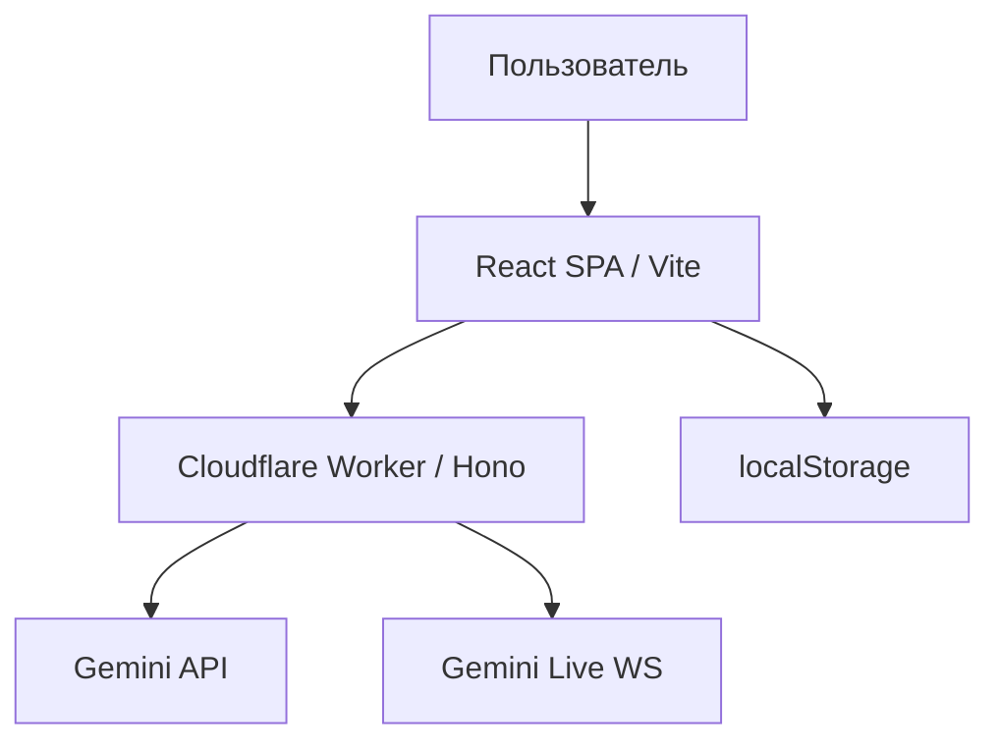

# Карта проекта Persony

## Идея

**Persony** (`persony.org`) — мессенджер с AI-персонажами. Знакомый UX Telegram, но с нейтральной тёмной темой и голосовыми возможностями через Gemini.

Для кого: люди, которые хотят общаться с настраиваемыми AI-собеседниками в привычном формате чата.

## Устройство

| Путь | Назначение |
|------|------------|
| `src/` | React UI |
| `worker/` | API + WebSocket proxy |
| `specs/` | Спеки (spec-driven) |
| `DESIGN.md` | Дизайн-система |
| `wrangler.jsonc` | Cloudflare конфиг |

## Статусы

### Готово

- MVP: чат, голосовые, live-звонки, персонажи
- Cloudflare Workers: https://persony.pavel-9e7.workers.dev
- GitHub: https://github.com/baver001/persony
- Дизайн-токены Persony (`DESIGN.md`, `src/index.css`)
- GitHub Actions deploy workflow (secrets настроены)

### В работе

- `GEMINI_API_KEY` в Cloudflare secrets
- Подключение persony.org

### Дальше

- Clerk auth
- Облачное хранение чатов
- Rate limiting / billing

### Проверить

- Live voice на Workers в production (nodejs_compat + @google/genai)

## Решения

- Не форкаем Telegram GPL-код — реимплементируем паттерны
- Деплой на Workers, не Express в production
- Нейтральная тёмная тема вместо синевы Telegram

## Режим зрелости

MVP

## Секреты

| Секрет | Где задать |
|--------|------------|
| `GEMINI_API_KEY` | `.dev.vars` локально, `wrangler secret put` в CF |
| `CLOUDFLARE_API_TOKEN` | GitHub Actions secrets |
| `CLOUDFLARE_ACCOUNT_ID` | GitHub Actions secrets (`9e75a3866eb9269f8d3c3407bdef7cf8`) |
