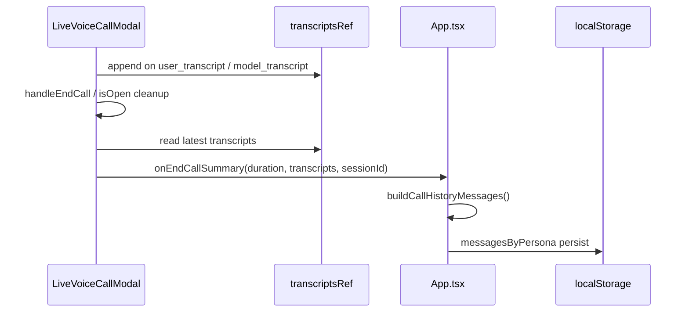

# Spec 03: Сохранение транскрипции голосовых звонков

## Проблема

После голосового звонка в истории чата остаётся только карточка «Голосовой звонок» с длительностью. Текст разговора не виден как диалог — пользователь теряет контекст общения.

## Корневая причина (баг)

`LiveVoiceCallModal.handleEndCall` читал `transcripts` и `duration` из **устаревшего замыкания** WebSocket-обработчика. В момент завершения звонка массив часто был пустым, хотя субтитры в UI отображались корректно.

Дополнительно: при закрытии модалки через `isOpen=false` без явного `handleEndCall` финализация не вызывалась.

## Цель

После каждого завершённого звонка в истории чата появляется:

1. **Маркер сессии** — компактная системная карточка с длительностью.
2. **Диалог** — каждая реплика пользователя и персонажа как отдельное сообщение в ленте (как в обычном мессенджере).

Данные сохраняются в `localStorage` вместе с остальной историей.

## UX

```
[📞 Голосовой звонок · 2:34]          ← системная карточка (слева/центр)
Привет! Как дела?                     ← реплика персонажа (пузырь)
Всё отлично, расскажи про стратегию   ← реплика пользователя
...
```

- Реплики из звонка визуально совпадают с обычными пузырями; опционально — маленькая метка 🎙️.
- Старые карточки с вложенной стенограммой (`callTranscripts`) продолжают работать (обратная совместимость).
- В сайдбаре превью последнего сообщения — текст последней реплики, а не «Голосовой звонок».

## Модель данных

```ts
interface ChatMessage {
  // ...existing
  isFromVoiceCall?: boolean;      // реплика из голосового звонка
  voiceCallSessionId?: string;    // группировка одной сессии
}
```

Сессия звонка: `call_{timestamp}_{random}`.

## Поток данных



## Надёжность

| Механизм | Зачем |
|----------|-------|
| `transcriptsRef` | Актуальные реплики вне React closure |
| `durationRef` | Корректная длительность |
| `statusRef` | Корректная проверка в `ws.onclose` |
| `finalizedRef` | Идемпотентность — один save на звонок |
| `sessionId` dedup в App | Защита от двойной записи |
| `finalizeCall` при `isOpen=false` | Save при любом способе закрытия |

## Worker

Для Live API отправлять клиенту только `inputAudioTranscription` / `outputAudioTranscription`, не дублировать `modelTurn.parts.text` (иначе двойной текст в стенограмме).

## Критерии готовности

- [x] После звонка ≥1 реплики в истории видны как пузыри user/character
- [x] Карточка длительности присутствует
- [x] Перезагрузка страницы не теряет диалог
- [x] Повторный `handleEndCall` не дублирует сообщения
- [x] Старые чаты с `callTranscripts` в карточке не ломаются

## Вне scope

- Облачная синхронизация
- Редактирование/удаление отдельных реплик звонка
- Real-time запись в чат во время звонка (только при завершении)
